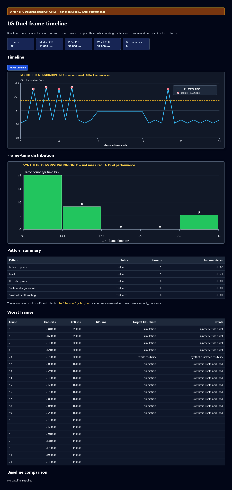

# Performance Benchmarks

LG Duel benchmarks are repeatable, opt-in developer artifacts for finding rendering regressions. They are not a gameplay mode, a player-facing quality setting, or an authority path. Normal client and server launches do not load benchmark scenarios.

Descriptors live in `config/benchmarks/`. Results, screenshots, and comparison baselines belong under `build/benchmarks/<scenario>/<run_group>/<run_id>/` and are ignored by Git. Do not commit a result as a universal performance claim: drivers, power policy, compositor state, and selected backend all matter.

## Architecture And Trust Boundary

The normal client contains a benchmark recorder that is inert unless the process is launched with both `--dev-control` and `--benchmark`. The recorder uses the same renderer-facing state and map-loading rules as ordinary play, but it does not add timing data or synthetic state to UDP packets, snapshots, or `ServerGame`. The benchmark camera is presentation-only; bot setup still travels through the existing server-authoritative command path.

The existing localhost developer-control plane remains the reusable seam for a live-client benchmark that needs map loading, a development camera, or a real PNG capture. It is opt-in (`--dev-control`/`--control-port`), loopback-only, and unavailable in normal play. A benchmark must use that structured control plane rather than grow a general console or remote-control interface. Its development camera changes only the state passed to rendering, not an authoritative player body.

MCP is separate from gameplay networking. The repository-local MCP adapter calls the same Python orchestration and typed loopback operation as the CLI, then returns summaries and artifact references. It does not own frame timing, make the client authoritative, or expose a non-loopback listener.

## What Is Measured

Each result must label every metric with its scope.

| Category | Meaning |
| --- | --- |
| Direct | Client-thread wall time around a measured render frame; the primary frame-time distribution. |
| Render-frame subsystems | Coarse client-thread CPU spans for network processing, fixed-tick work performed during the frame, movement/collision, traces, interpolation, animation, world visibility, render-instance construction, world and dynamic command encoding, UI, swapchain acquisition, and submission. Nested spans are attribution data and must not be added together as if they were disjoint. |
| Simulation-tick subsystems | One sample per client fixed prediction tick for inclusive tick simulation plus its nested network, movement/collision, and trace spans. A render frame may contain zero or multiple tick samples. |
| Derived | Mean, p50, p95, p99, maximum, FPS conversion, run-to-run deltas, and regression verdicts calculated from direct samples. |
| Backend-specific CPU timing | Renderer diagnostics such as scene build, dynamic upload preparation, swapchain acquire, draw issue, submit, total render, and diagnostics counts. These remain CPU-side observations and retain backend/present-mode labels. |
| GPU execution timing | A GPU timestamp interval covering measured commands in LG Duel's primary per-frame SDL GPU command buffer, from the first measured GPU command through the final measured GPU command. |
| Unavailable | GPU allocation cost, GPU memory use, general GPU use, and presentation latency. CPU submit/acquire timing is not a substitute for GPU execution time. |

The main GPU interval excludes CPU scene build and command encoding, swapchain
acquire blocking, queue delay before the first command starts, present,
compositor work, scanout, and work in other command buffers. It does not measure
input or presentation latency.

The outline interval covers the compatibility clear and depth work when that
work runs, then the outline mask, dilation, and composite work. It excludes all
other GPU work. Each frame states whether the outline interval applies. A
missing value stays empty; it never becomes zero.

GPU timestamps arrive several frames after submission. The renderer tags each
measured command buffer with its exact benchmark frame id. The benchmark polls
ready results during the run, then waits for the remaining results only after
CPU frame sampling stops. It patches the sample with the matching id. Warmup
frames have no tag and never enter either CPU or GPU summaries.

This support needs the SDL_GPU Vulkan path and the optional patched SDL build.
The patch adds a small timestamp and readback cost to measured frames. Results
record whether timing is available, the backend, timestamp valid bits and
period, readback delay, tool version, and the SDL base and patch identity. The
build picks the patched SDL form when it is present. A later official SDL query
API can replace the patch without changing the metric scope. SDL_Renderer and
an unpatched SDL build report a clear reason and leave timing cells empty. GPU
timing support does not affect benchmark validity.

Record selected backend, requested and selected present mode, resolution, fullscreen/vsync/frame-cap state, map content hash, scenario/version, build identity, system/driver information, and any fallback. The shared GPU launcher queries `vulkaninfo --summary` outside the measured interval, verifies the selected Intel ICD before startup, and attests the renderer after control answers. Benchmark child processes remove `VK_DRIVER_FILES` and `VK_ICD_FILENAMES` so the Vulkan loader uses its normal driver search. Results record the physical-device name, driver name/version, Vulkan API version, ICD manifest SHA-256, resolved driver library, and verification state. This metadata is written to both `aggregate.json` and every native `run-*/result.json`. A GPU-required scenario aborts if the renderer falls back or any attested value differs. Comparisons reject a different GPU, graphics-driver version, or Vulkan API version.

### Percentiles

Version 1 uses nearest rank: sort samples ascending and select the one-based rank `ceil(p * N)`. It never interpolates a frame time that was not observed. `p99.9` is reported only for at least 1,000 samples. Changing this convention requires a benchmark-version bump or an explicit incompatible-comparison refusal.

`telemetry.csv` records the per-render-frame subsystem values and
`simulation-ticks.csv` records the independent fixed-tick stream. `result.json`
exposes median, p95, and p99 for every subsystem under
`subsystem_timings.render_frame` and `subsystem_timings.simulation_tick`.
GPU values use the same nearest-rank rule under `gpu_execution_timings`.
`telemetry.csv` stores `gpu_primary_command_buffer_ms`, `outline_gpu_ms`, and
`outline_gpu_state`; unavailable numbers use empty cells.
All spans use `steady_clock`; the extra clock reads are enabled only during the
measured benchmark stage. Renderer spans are CPU command construction and API
submission time, never GPU execution time.
Second-based runs reserve for up to 4,096 render samples per second before
measurement; exceeding that safety ceiling aborts instead of reallocating and
polluting the measured tail.

### Per-frame timeline and visual report

Native runs may also write `frame-timeline.json` (schema version `1`). This is
the stable per-frame artifact: each frame has a `frame_index`, elapsed time,
total CPU time, optional total GPU time, named CPU/GPU values, workload
counters, and an `event_markers` array. GPU values are `null` or absent when the
backend cannot provide execution timing; CPU submit or swapchain time must not
be relabelled as GPU time. Fixed simulation ticks are kept as event markers
(with their tick index and name when available), so one render frame can show
zero, one, or several tick events.

`telemetry.csv` and `simulation-ticks.csv` remain the raw measurement source of
truth. The JSON timeline joins those streams for frame inspection and does not
replace either CSV. Reports must use the recorded values and metadata, without
re-measuring a run.

Generate a portable report from a candidate, and optionally a compatible
baseline, with:

```powershell
python scripts/lg_frame_timeline_report.py build/benchmarks/<scenario>/<run-group>/run-1 --baseline build/benchmarks/<scenario>/<baseline-group>/run-1 --output build/benchmarks/<scenario>/timeline-report
```

The command writes a self-contained `frame-timeline.html`, a static
`frame-timeline.svg`, and a machine-readable `timeline-analysis.json`. The HTML has an inspectable frame
timeline, distribution, worst-frame table, pattern summary, and (when the
metadata permits) baseline-versus-candidate deltas. It runs in headless CI and
uses no chart package or network fetch.

Version 1 classifies isolated spikes, bursts, periodic spikes, sustained
regressions, and alternating or sawtooth pacing with fixed deterministic
thresholds. `timeline-analysis.json` records those thresholds, sample counts, and a
confidence level for each finding; too few samples or missing fields produce
`unavailable` rather than a guess. A marker or subsystem that overlaps a spike
is a correlation only. The report does not prove that marker or subsystem
caused the frame cost.

The screenshot below shows the standalone report layout. It uses synthetic
data only and is not a measured LG Duel performance result.



## Scenario Format

Every descriptor is JSON with `schema_version: 1` and `expected_benchmark_version: 1`. Curated descriptors also carry `benchmark_version: 1` as human-readable metadata. A runner must reject a future or incompatible version rather than guessing semantics.

| Field | Required semantics |
| --- | --- |
| `name`, `labels`, `map` | Safe identifier, searchable classification, and a repository map name. The map must load and its content hash is compatibility data. |
| `backend_requirement` | `gpu` requires the SDL_GPU path; no fallback result may be compared as equivalent. |
| `resolution`, `fullscreen`, `vsync`, `frame_cap`, `fov` | Explicit presentation contract. `frame_cap: 0` means uncapped. |
| `warmup_seconds` or `warmup_frames`; `measured_seconds` or `measured_frames` | Exactly one unit must be supplied for each phase. Warmup has no timing samples; only the measured interval contributes samples. Curated descriptors use explicit 2–5 second warm-ups and 5–25 second measured intervals. |
| `camera_start`, `camera_path` | LG-unit position plus degree yaw/pitch/FOV. `camera_path` is a direct ordered array of keyframes, each using exactly one of normalized `progress` or `time_seconds`. |
| `player_state` | Presentation-only local-player state and UI visibility. It is not a server command. |
| `actors` | Structured requested bot setup: `bots`, `attack_mode`, `stare`, `standstill`, `dodge`, optional dodge intervals, and `expected_count`; `commands` documents the equivalent real console sequence. |
| `effects` | Requested bounded projectile/tracer/explosion load. `fixture_only: true` explicitly marks synthetic presentation content. |
| `cvars` | Narrow presentation-only overrides. They must be emitted in the result and restored/isolated by the runner. |
| `screenshots` | Array of `{ "name", "progress" }`; capture happens outside timed sampling. |
| `residual_nondeterminism` | Honest list of known uncontrolled inputs or unsupported conditions; an empty list means none are known. |

Camera progress uses measured elapsed time quantized down to the 125 Hz simulation interval, not mouse input. A time/progress value therefore resolves to the same transform independent of render rate. Keyframes must be nondecreasing and are linearly interpolated between fixed positions/angles; duplicate static endpoints intentionally make a stationary camera explicit.

The eight supplied scenarios establish a small comparison suite:

- `eyetoeye-static-baseline`: low-action cached-world control.
- `eyetoeye-duel-like`: normal two-participant Lightning-Gun bot duel request.
- `eyetoeye-bot-animation`: six-player bot movement/animation request using Machine Gun bot models plus `bot_add`, `bot_weapon`, `bot_dodge`, `bot_stare`, and `bot_standstill`; it is a retained comparison workload, not the 16-player capacity ceiling.
- `eyetoeye-projectile-effects`: a declarative future projectile/effect presentation fixture. Current bots select only the Lightning Gun and the native runner does not inject synthetic projectiles, so this descriptor is deliberately marked invalid at execution (`supported_workload: false`) rather than silently measuring a different workload. Use the headless `trace-projectile` workload for current quantitative projectile-query evidence.
- `overkill-high-visibility`: static large-map structural/sightline stress using a checked-in `overkill_import` camera preset.
- `eyetoeye-static-long`: 5-second warm-up plus a 25-second static baseline for tail stability.
- `overkill-static-flythrough`: deterministic 15-second presentation-only camera interpolation through all three checked-in Overkill structural views; the world remains static.
- `overkill-static-flythrough-bvh-off`: identical camera workload with only `r_world_frustum_cull` disabled, providing a same-build control for static-world BVH comparisons.

`r_world_frustum_cull` is intentionally experimental and defaults off. Promote it
only when repeated same-host comparisons against the `bvh-off` descriptor meet
the frame-median and p95 budgets without excessive material-range inflation.

The camera coordinates come from `config/dev-camera-presets.json`, not arbitrary map-space guesses. Bot commands are current commands: `bot_add [count]` is permitted only in warmup; `bot_attack 0|off|easy|medium|hard`, `bot_weapon <weapon>`, `bot_stare`, `bot_standstill`, and `bot_dodge` control supported training behavior. Bots default to Machine Gun, and benchmark scenarios can select another authoritative bot weapon with `actors.weapon`.

## Running, Repeating, And Comparing

Benchmarks use the optimized `perf` Release preset by default. Configure it once,
then rebuild it incrementally after each code change:

```powershell
cmake --preset perf
cmake --build --preset perf
```

The wrapper starts an owned client from `build/perf` with the explicit benchmark
flag. The PowerShell wrapper owns the supported CLI contract:

```powershell
.\scripts\lg-benchmark.ps1 list
.\scripts\lg-benchmark.ps1 run --scenario eyetoeye-static-baseline --repetitions 5 --json
.\scripts\lg-benchmark.ps1 baseline-create --scenario eyetoeye-static-baseline --name gpu-driver-current --repetitions 5
.\scripts\lg-benchmark.ps1 compare --baseline gpu-driver-current --result build/benchmarks/eyetoeye-static-baseline/<run-group> --threshold-percent 5 --tail-threshold-percent 8
.\scripts\lg-benchmark.ps1 report --result build/benchmarks/eyetoeye-static-baseline/<run-group> --detailed
```

Use `--build-mode debug` on `run`, `sim-run`, or `baseline-create` only when a
Debug measurement is intentional. Debug mode selects `build/default`; Release
and Debug artifacts are recorded as different build modes and cannot be compared
as a normal regression result.

```powershell
.\scripts\lg-benchmark.ps1 run --scenario eyetoeye-static-baseline --build-mode debug
```

Shared simulation hot paths have a separate headless executable so renderer scheduling cannot be mistaken for collision cost. The same PowerShell entry point builds artifact-compatible reports:

```powershell
.\scripts\lg-benchmark.ps1 sim-run --workload movement-collision --map overkill_import --repetitions 5 --warmup-batches 40 --measured-batches 60 --operations-per-batch 256
.\scripts\lg-benchmark.ps1 sim-run --workload trace-projectile --map overkill_import --repetitions 5 --warmup-batches 60 --measured-batches 100 --operations-per-batch 256
```

### Revision and result-set comparison

Phase 3 adds one policy-based comparison command on top of these artifacts:

```powershell
python scripts/lg_compare_benchmarks.py `
  --baseline origin/main `
  --candidate HEAD `
  --suite pr_headless `
  --repetitions 5 `
  --profile pr_headless `
  --output build/verification/benchmarks
```

The revision mode resolves both refs to commits, rejects an uncommitted candidate,
and creates two detached worktrees below the new output directory. It configures
separate Release builds with the same options, runs the same bounded suite, copies
raw results and logs into the output, then removes only the worktrees and build
trees it created. It never resets, cleans, or changes the active worktree. A failed
configure, build, run, or cleanup still leaves a partial `manifest.json`.

Existing result sets can be checked without a rebuild:

```powershell
python scripts/lg_compare_benchmarks.py `
  --baseline-results build/verification/baseline `
  --candidate-results build/verification/candidate `
  --profile pr_headless `
  --output build/verification/comparison
```

Each result root must contain exactly one valid `aggregate.json` for every scenario
required by the selected policy profile. Missing, extra, duplicate, malformed, or
mixed scenario artifacts fail before any percentage is calculated.

`config/performance-policy.json` is the versioned source of truth. The
`pr_headless` profile uses five runs of the two shared-simulation workloads and
conservative CPU limits. It also requires the same compiler version, build type,
generator, simulation build options, and collision query mode. SDL source,
fetch, require, tag, and patched-build settings appear under
`environment.sdl_configuration`; `pr_headless` ignores them because its
benchmark links only the shared core. The `trusted_gpu` profile compares both
`environment.compile_time_options` and `environment.sdl_configuration`. It
requires five verified SDL_GPU/Vulkan runs on the same build, SDL setup, GPU,
driver, API, renderer, observed resolution, Vulkan ICD record, map, and
scenario. A fallback result can never satisfy that profile.

The policy uses these results:

- `PASS`: all required evidence and stable metrics meet the limits.
- `WARN`: a repeatable change exceeds both warning limits.
- `FAIL`: a hard limit or required check fails, or a stable change exceeds both
  failure limits.
- `INCONCLUSIVE`: too few valid runs or too much run-to-run spread prevents a
  sound timing verdict.
- `NOT_COMPARABLE`: a material scenario, build, host, renderer, protocol, or
  settings field differs or is missing.
- `UNAVAILABLE`: an optional metric, such as unsupported GPU timing, is absent.
- `SKIPPED`: a metric does not apply to that scenario.

A timing regression must exceed both its absolute and relative limit. This keeps
small shifts near zero from failing a change. A zero baseline uses the absolute
limit alone. Tukey outliers remain in the result; reports list their run number,
fences, and all pre-exclusion values. Version 1 never drops an outlier.

The tool writes deterministic `comparison.json` and `report.md` files. The JSON
includes comparability checks, run counts, raw run values, medians, spread,
outliers, limits, hard checks, and per-metric status. The Markdown puts hard
correctness failures before the timing table and calls out the largest regression,
largest improvement, unavailable data, and noisy data.

The common CI evidence helper writes or updates a portable evidence root:

```powershell
python scripts/lg_verification.py protocol-budget --evidence-root verification
python scripts/lg_verification.py collect-ci `
  --evidence-root verification `
  --platform windows `
  --category protocol `
  --status success
```

Its manifest uses relative artifact paths with hashes and sizes. The protocol
record runs the real protocol tests, checks the source ceiling remains 1,200
bytes, records parsed packet sizes, and fails when the encoder test or hard limit
fails. Revision and stored-result comparisons also require the configured source
ceiling to equal 1,200 bytes; a low observed packet size cannot hide a raised
ceiling.

`movement-collision` drives the real shared 125 Hz `simulateMovement` path from fixed spawn states and commands. `trace-projectile` separately measures long `traceWorld` rays and short projectile-style swept segments. Both hash all returned state, repeat the identical workload, and invalidate a result if replay checksums differ. `--force-linear` disables the derived collision index for a paired same-binary broadphase comparison; it is a diagnostic implementation selector and is recorded in native JSON.

Use `--port`, `--timeout`, or `--json` when the wrapper needs those global options. The exact executable/build directory is preset dependent; use wrapper help rather than assuming a packaged game contains it. MCP exposes the same opt-in work as thin adapter tools: `lg_list_benchmarks`, `lg_run_benchmark`, `lg_compare_benchmarks`, `lg_get_benchmark_result`, and `lg_create_benchmark_baseline`. It returns structured results and requested PNGs, not a hand-written summary.

A run warms selected map, renderer resources, and fixed scenario state; then resets scenario time/state for every repetition and collects only the declared measured interval. Screenshots, PNG encoding, filesystem writes, process start-up, map loading, baseline reading, and comparison output are outside timing samples. Results retain raw samples and a per-run summary so a future percentile implementation can be audited.

Use one baseline per comparable environment. By default the comparator refuses different scenario/version, map hash, backend or fallback, resolution, presentation settings, camera/state hash, or percentile method. An explicit force option may produce an annotated non-comparable report, never a normal regression verdict. For repeats, compare the documented aggregate (for example, median of per-run p95 values) rather than the luckiest run.

The simulation runner first summarizes batch samples within each repetition, then uses the median of repetition medians and the median of repetition p95/p99 values. Stability is the coefficient of variation across repetition medians. Batch-to-batch geometry differences therefore do not masquerade as host noise. Tukey outliers remain in all statistics and are reported.

## Static Collision Broadphase

Packaged maps build a deterministic immutable flattened BVH when `loadLocalMap` succeeds. It indexes static wall AABBs and convex-brush bounds only; players and projectiles remain the existing small bounded sets. Movement sweeps and world traces query conservative AABBs, mark candidates in fixed wall/brush bitsets, then run the existing narrow phase in ascending authored order. BVH traversal order can therefore never change equal-distance or walkable-drop tie behavior. Directly constructed/unfinalized arenas, stale count metadata, and traversal-stack overflow use the original linear path.

The index is derived data held alongside `Arena`; it is omitted from map hashes and network encoding, so no protocol field or gameplay snapshot changed. `lg_duel_arena_broadphase_tests` compares indexed and forced-linear results bit-for-bit for 1,000 rays and 500 movement sweeps on every packaged map. The simulation workloads provide the paired quantitative gate before enabling further indexed query types.

## Validity And Visual Safeguards

A usable result has the requested backend, exact warmup/measured counts, finite nonnegative samples, compatible metadata, and no scenario-validation warning. It records a real rendered screenshot at each requested progress for human visual review. Screenshots verify composition, material availability, missing geometry, visible actor/effect load, and backend fallback; they are not pixel-perfect cross-driver tests.

Do not hide a regression by disabling culling, players, weapons, effects, outlines, HUD, or texture behavior unless the descriptor labels that choice and the comparison uses that same choice. Conversely, do not enable debug HUDs, logs, captures, or GPU readbacks inside measurement. A visual fixture must be labelled `fixture_only`; it is evidence about a renderer path, not evidence that server combat produced the state.

## Adding A Scenario

1. Copy a small descriptor in `config/benchmarks/` and retain version `1`.
2. Select a checked-in map and verified camera coordinate/preset; use a fixed static path unless camera motion is what the scenario measures.
3. State resolution, backend, pacing, warmup, measured duration, actors, effects, and screenshot progress explicitly.
4. Use real server bot commands where available. If desired gameplay is unsupported, fail the authoritative scenario or declare the remaining renderer fixture and its limitation in `residual_nondeterminism`.
5. Run it repeatedly, inspect PNGs, and add focused parser/state-hash tests with the implementation. Do not add a baseline artifact to source control.

## Reproducing And Interpreting Results

Use AC power and a stable power plan, close GPU-heavy applications, wait for background work to settle, and run enough repeats to see variance. Record driver/OS/build changes. Compare p50 for typical cost and p95/p99/max for pacing risk; average FPS alone is insufficient. A direct CPU-time change is a regression signal, not proof of GPU execution speed.

Static-world improvements should show in the GPU-required static baseline; dynamic player/outline/effect work needs the corresponding diagnostic counts. A high-visible imported map is a useful structural stress case, not a proxy for every duel map. SDL_Renderer fallback is less representative because it lacks the static SDL_GPU world cache and screen-space outline path; never merge it into GPU baseline trends.

## Troubleshooting

- **Benchmark control unavailable:** build the client, stop any ordinary development-control client on the chosen port, and let the wrapper relaunch it with `--benchmark`.
- **GPU requirement failed:** record the fallback/error and fix the selected SDL_GPU backend/driver before comparing results.
- **Vulkan loader has no valid default ICD:** repair the driver install so `vulkaninfo --summary` can find the Intel ICD through the loader's normal driver search. Benchmark child processes remove `VK_DRIVER_FILES` and `VK_ICD_FILENAMES`.
- **Map or textures differ:** rerun from the same repository/build output and inspect map content hash and screenshot. Imported-map texture coverage can differ from compact `eyetoeye`.
- **Bot setup rejected:** start from warmup; `bot_add` cannot change the roster after warmup. Verify `expected_count` before timing.
- **Noisy p95/p99:** repeat the scenario, check thermal/power/compositor changes and background work, and compare compatible runs only.
- **Projectile claim is misleading:** use the supplied scenario only as a labelled presentation fixture until bots can authoritatively select projectile weapons through a deterministic gameplay path.
